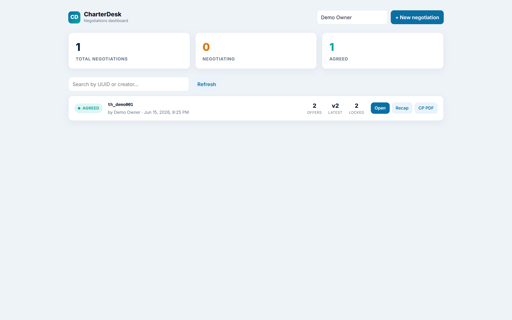
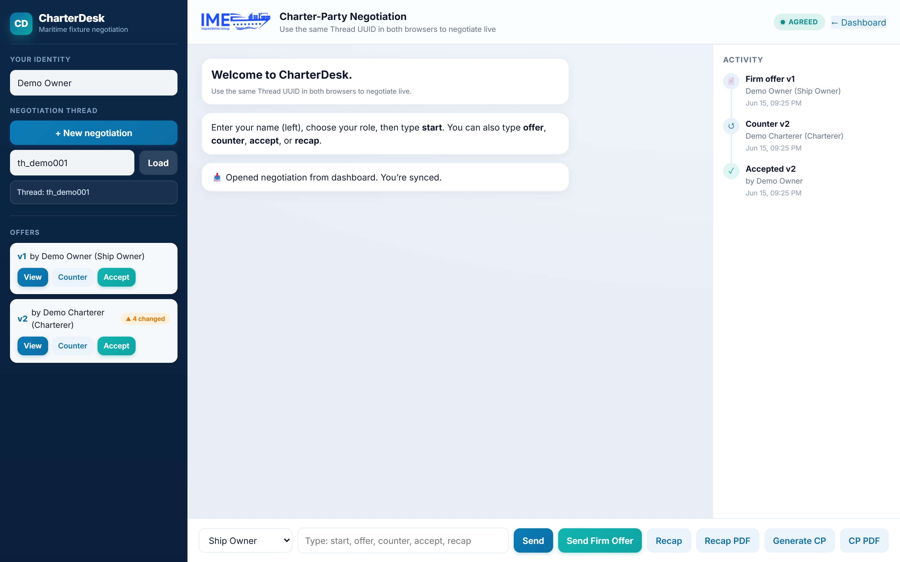
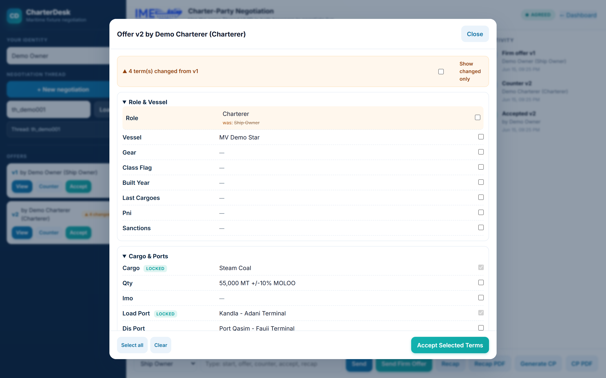
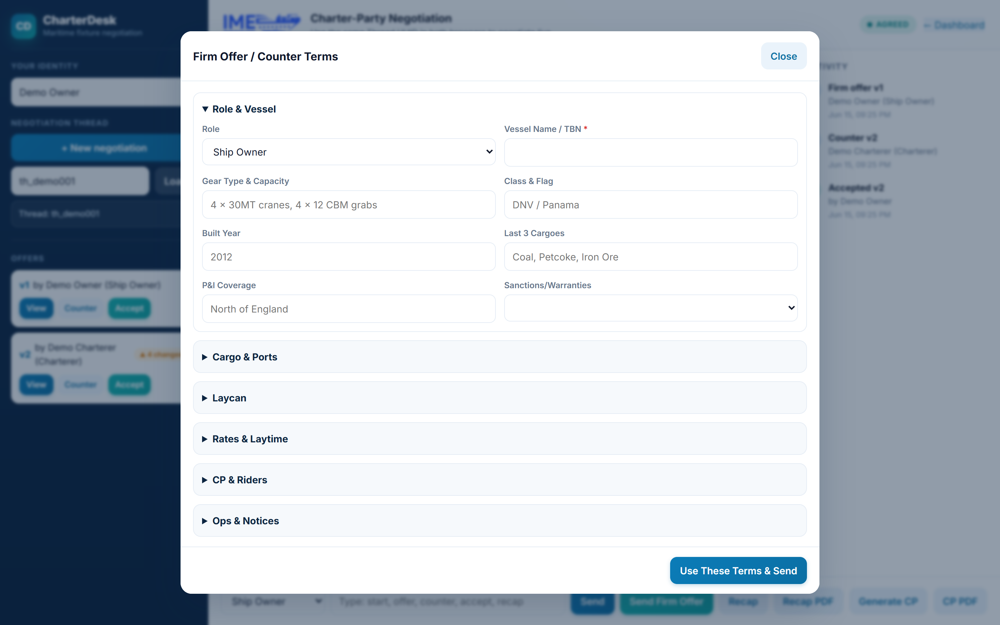
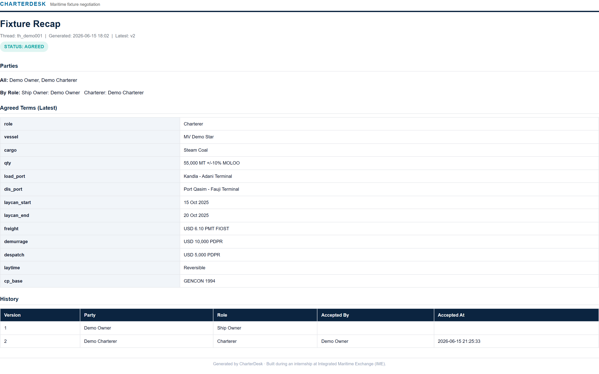

# CharterDesk  
_A structured charter-party (CP) negotiation and document-generation tool for maritime fixture deals._

> Built during an internship at **Integrated Maritime Exchange (IME)**.

[](#7-running-the-application)
[](#14-switching-between-html-and-pdf-recap)
[](#14-switching-between-html-and-pdf-recap)

---

## 1. Overview

CharterDesk is a PHP + MySQL application (runs on XAMPP) for structured, guided voyage
fixture negotiations between **Ship Owners**, **Charterers**, **Buyers**, and **Sellers**.
Two parties negotiate the ~38 terms of a shipping fixture in versioned offers, lock the
terms they agree on, and export a finished **Charter Party** or **recap** as HTML or PDF.

**Key Features**
- Negotiations **dashboard** with status (Open / Negotiating / Agreed), per-thread stats and search
- Role-based, two-party negotiation over a shared thread UUID, with live polling
- Firm Offer -> Counter -> Accept workflow with **versioned offers**
- Collapsible ~38-term fixture form (vessel, cargo, laycan, freight, demurrage, laytime, NOR, arbitration, CP form, ...) with **required-field validation**
- **Version diff**: changed terms are highlighted and show their previous value, with a "show changed only" toggle
- **Activity timeline** of every offer, counter and acceptance, plus a live status badge
- Locked-field system: accepted terms carry forward and are protected in counters
- Branded **Charter Party** and **fixture recap** generation as HTML or PDF (dompdf)

**AI Assist (Claude):** an in-app assistant that **explains** unfamiliar CP terms, **drafts**
riders/clauses from a plain-English prompt, and **reviews** the latest offer to flag unusual or
risky terms. Backed by [`assist.php`](assist.php) calling the Claude Messages API
(`claude-opus-4-8`). Set an `ANTHROPIC_API_KEY` before starting PHP to enable it:

```bash
# Windows (PowerShell)
$env:ANTHROPIC_API_KEY = "sk-ant-..."
C:\xampp\php\php.exe -S 127.0.0.1:8000 -t .

# macOS / Linux
ANTHROPIC_API_KEY=sk-ant-... php -S 127.0.0.1:8000 -t .
```

The key is read from the environment only - it is never committed. Without it, the rest of the
app works normally and the Assist panel shows a friendly "key not set" message.

---

## Screenshots

**Negotiations dashboard** - status tiles, per-thread stats, search:



**Negotiation workspace** - offers, activity timeline, live status badge:



**Version diff** - changed terms highlighted with their previous value, plus locked-term badges:



**Firm-offer / counter form** - grouped sections with required-field validation:



**Generated fixture recap** (HTML / PDF via dompdf):



---

## 2. Requirements

| Tool | Purpose | Command |
|------|----------|----------|
| XAMPP | PHP 8 +, Apache, MySQL | `php -v` |
| Git | Version control | `git --version` |
| Composer | PHP package manager | `composer -V` |

---

## 3. Project Structure

Place under your webroot:

```
C:\xampp\htdocs\ime-negotiation
```

```
dashboard.html        Negotiations dashboard (landing page)
index.html            Negotiation workspace (offers, timeline, composer)
assets/
  css/app.css         Design system + all component styles
  js/app.js           Workspace logic
  js/dashboard.js     Dashboard logic
dashboard_data.php    Aggregated overview feed (read-only)
create_thread.php     New negotiation
get_thread.php        Fetch thread + offers
save_offer.php        Save offer / counter (handles locked fields)
lock_fields.php       Lock agreed fields
accept_offer.php      Record acceptance
generate_cp.php       Charter Party (HTML / PDF)
generate_recap.php    Fixture recap (HTML / PDF)
db.php / db_connect.php  DB connection (PDO + mysqli)
questions.json        Fixture term definitions
sql/
  schema.sql          Database schema (run once)
  seed.sql            Optional demo data
scripts/              Dev utilities (schema migration / inspection)
composer.json         PHP dependencies (dompdf)
readme.md             This file
```

---

## 4. Database Setup

The full schema lives in [`sql/schema.sql`](sql/schema.sql). Create everything in one step:

```bash
# from the project root
mysql -u root < sql/schema.sql

# optional: load demo data (one negotiation with an accepted counter)
mysql -u root < sql/seed.sql
```

Or import `sql/schema.sql` (then `sql/seed.sql`) through **phpMyAdmin**. Both target the
`ime_negotiation` database and are safe to re-run (`CREATE ... IF NOT EXISTS`).

---

## 5. Database Connection

Connection settings live in **`db_connect.php`** and are read from environment
variables, with XAMPP-friendly defaults for local development:

| Variable | Default | Purpose |
|----------|---------|---------|
| `DB_HOST` | `127.0.0.1` | MySQL host |
| `DB_PORT` | `3306` | MySQL port |
| `DB_USER` | `root` | MySQL user |
| `DB_PASS` | _(empty)_ | MySQL password (XAMPP default is empty) |
| `DB_NAME` | `ime_negotiation` | Database name |

For local XAMPP you can leave the defaults as-is. For any deployment, set the
`DB_*` variables in your environment instead of hardcoding credentials.

Backend files include the connection with:
```php
require 'db_connect.php';   // exposes $conn (mysqli)
```

---

## 6. Install Dependencies

Dependencies are managed by Composer and are **not** committed to the repo, so
install them after cloning:

```bash
cd C:\xampp\htdocs\ime-negotiation
composer install
```
This installs everything pinned in `composer.lock` (including `dompdf/dompdf`).
If you see `missing zip extension`, enable `extension=zip` in `php.ini`.

---

## 7. Running the Application

1. Start **Apache** and **MySQL** in XAMPP.  
2. Open the dashboard (recommended entry point):  
   ```
   http://localhost/ime-negotiation/dashboard.html
   ```
   From there, create or open a negotiation - it deep-links into the workspace
   (`index.html?uuid=...`). You can also open `index.html` directly.

---

## 8. Basic Usage

### Start / Join
- Enter your **name** and **role**
- Click **Start New** or **Load** (with UUID)

### Create Offer
- Type `offer` or click **Send Firm Offer**
- Fill the 40-question collapsible form  
- Submit to generate v1 offer

### Counter / Accept
- Counterparty views and counters existing offers
- Accepted terms auto-lock; only unresolved ones reappear

### Recap
- Once agreed, click **Recap**
- Opens fixture recap (HTML or PDF)

---

## 9. Chat Commands

```
start          → show quick help
offer          → open form
counter        → counter last offer
accept         → accept latest offer
recap          → open recap
load th_xxxxx  → load a thread by UUID
```

---

## 10. Git Workflow

```bash
git add -A
git commit -m "update UI, locking, recap"
git push
```
First-time setup:
```bash
git branch -M main
git remote add origin https://github.com/KanishkSigar/IME-AI-Chat-.git
git push -u origin main
```

---

## 11. Public Testing via Ngrok

```bash
ngrok http 80
```
Share:
```
https://abcd-1234.ngrok-free.app/ime-negotiation/
```
If Apache uses port 8080:
```
ngrok http 8080
```

---

## 12. Troubleshooting

| Issue | Cause | Fix |
|-------|--------|-----|
| JSON parse error | PHP emitted HTML error | Check DevTools → Network |
| View/Counter not working | Invalid JSON | Ensure `header('Content-Type: application/json')` |
| Recap missing names | Join same UUID | Reload after login |
| PDF blank | Dompdf not installed | `composer require dompdf/dompdf` |
| Thread not found | Wrong UUID | Start new negotiation |

---

## 13. Switching Between HTML and PDF Recap

### HTML Recap (default)
Frontend link:
```
generate_recap.php?uuid=<thread_uuid>
```
Opens a printable web recap.

### PDF Recap
1. Confirm Dompdf installed  
2. Change link to:
   ```
   generate_recap_pdf.php?uuid=<thread_uuid>
   ```
Downloads `fixture_recap_<uuid>.pdf` directly.  
Switch freely between the two modes—no rebuild required.

---

## 14. Production Recommendations

- Add authentication & permissions  
- Sanitize all user inputs  
- Move credentials out of webroot  
- Enable HTTPS & CSRF protection  
- Implement rate limits and audit logging

---
Developed by **IME Negotiation Automation Team**  
© 2025 IME Platform / TBI-GEU Innovation Lab
